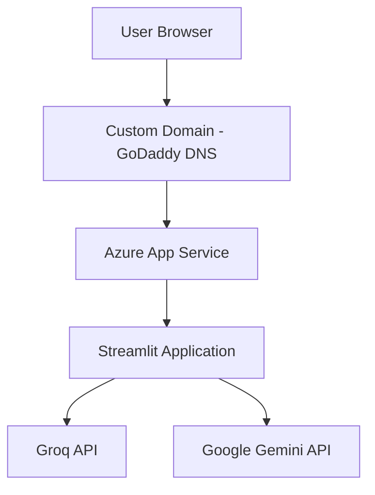
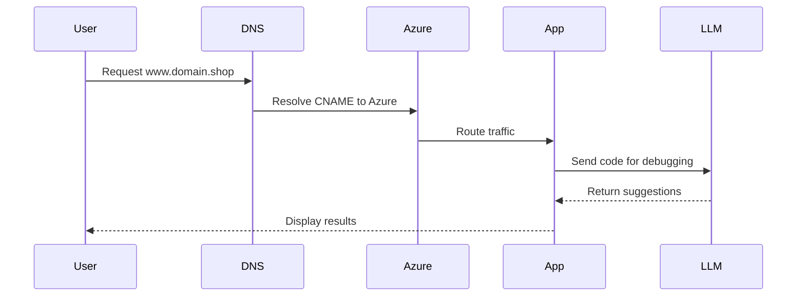
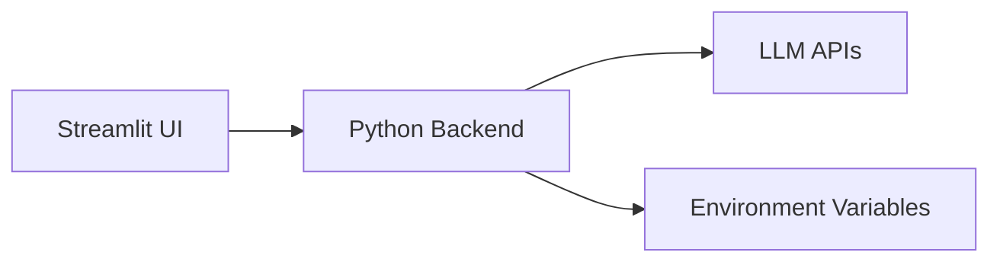

# AI Debugging Assistant

An AI-powered web application that analyzes Python code and error logs and provides debugging assistance using LLM APIs.

---

# Architecture Diagram



---

# Deployment Flow



---

# System Components



---

# Project Structure

```plaintext
.
├── apps/
├── config/
├── utils/
├── main.py
├── requirements.txt
└── README.md
```

---

# Tech Stack

* Python 3.12
* Streamlit
* Groq API
* Google Generative AI
* Azure App Service
* Custom Domain (GoDaddy)
* SSL (Azure Managed Certificate)

---
